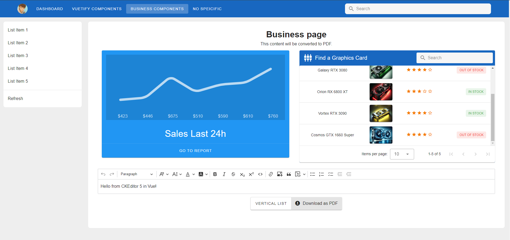

# [Turborepo](https://turbo.build/) - [React](https://react.dev/), [Next.js](https://nextjs.org/), [Vue 3](https://vuejs.org/), [Angular](https://angular.dev/), [Express](https://expressjs.com/)

* What is this?
  - Embedded with tutorials and simple apps for __various modern js frameworks.__
* This turborepo including:
  - Next.js, Angular tutorial.
  - Vue 3 & Vuetify custom component and various pages.
  - Node/Express backend server.

*Will include more apps than you might imagine.*
---

---

---

---
## Commands used to init apps

```sh
npx create-turbo@latest
npx create-next-app@latest
npm create vite@latest
npm create vue@latest
ng new angular-app
npm init express@latest
```

## What's inside?

This Turborepo includes the following packages/apps:

### Apps and Packages
  ***apps***
- `app-vuetify-custom`: a [Vue](http://vuejs.org) & [Vueitfy](https://vuetifyjs.com/) app
- `next-tutorial`: another [Next.js](https://nextjs.org/) app
- `angular-app`: an [Angular](https://angular.dev/) app
- `server`: a [Node.js](https://nodejs.org/) & [Express](https://expressjs.com/)  

 ***packages***
- `@repo/ui`: a stub React component library shared by both `web` and `docs` applications
- `@repo/eslint-config`: `eslint` configurations (includes `eslint-config-next` and `eslint-config-prettier`)
- `@repo/typescript-config`: `tsconfig.json`s used throughout the monorepo

Each package/app is 100% [TypeScript](https://www.typescriptlang.org/).

### [Vue 3](http://vuejs.org)
- `app-vuetify-custom` is a Vue 3 app with Vuetify.
  - Implemented vue-router and vuetify
  - Introduced vuetify-custom components
  - Several pages including business components
  - [Git link](https://github.com/YSHgroup/turborepo-best/tree/main/apps/vuetify-custom)

### [Next.js](https://nextjs.org/)
- `next-tutorial` is a Next.js app with simple dashboard.
  - come from [Next.js doc](https://nextjs.org/learn/dashboard-app)
  - Give knowledge of developing next.js app with best practice.
  - [Git link](https://github.com/YSHgroup/turborepo-best/tree/main/apps/nextjs-dashboard)
  - [Live link](https://next-tutorial-yshgroup.vercel.app/)

### [Angular](https://angular.dev/)
- `angular-app` is an Angular app including tutorial and kanbanboard page.
  - [Git link](https://github.com/YSHgroup/turborepo-best/tree/main/apps/angular-app)

  #### Kanbanboard
    - Angular 18, Angular Material - CDK, Bootstrap 5
    - Implemented drag and drop functionality
    - Utilized Bootstrap library
    - Integrated with express server

### [Node/Express](https://expressjs.com/)
- `server` is a Node.js & Express server.
  - Composed `kanban` router

### Utilities

This Turborepo has some additional tools already setup for you:

- [TypeScript](https://www.typescriptlang.org/) for static type checking
- [ESLint](https://eslint.org/) for code linting
- [Prettier](https://prettier.io) for code formatting

### Build

To build all apps and packages, run the following command:

```
cd my-turborepo
pnpm build
```

### Develop

To develop all apps and packages, run the following command:

```
cd my-turborepo
pnpm dev
```

### Remote Caching

Turborepo can use a technique known as [Remote Caching](https://turbo.build/repo/docs/core-concepts/remote-caching) to share cache artifacts across machines, enabling you to share build caches with your team and CI/CD pipelines.

By default, Turborepo will cache locally. To enable Remote Caching you will need an account with Vercel. If you don't have an account you can [create one](https://vercel.com/signup), then enter the following commands:

```
cd my-turborepo
npx turbo login
```

This will authenticate the Turborepo CLI with your [Vercel account](https://vercel.com/docs/concepts/personal-accounts/overview).

Next, you can link your Turborepo to your Remote Cache by running the following command from the root of your Turborepo:

```
npx turbo link
```

## Useful Links

Learn more about the power of Turborepo:

- [Tasks](https://turbo.build/repo/docs/core-concepts/monorepos/running-tasks)
- [Caching](https://turbo.build/repo/docs/core-concepts/caching)
- [Remote Caching](https://turbo.build/repo/docs/core-concepts/remote-caching)
- [Filtering](https://turbo.build/repo/docs/core-concepts/monorepos/filtering)
- [Configuration Options](https://turbo.build/repo/docs/reference/configuration)
- [CLI Usage](https://turbo.build/repo/docs/reference/command-line-reference)
